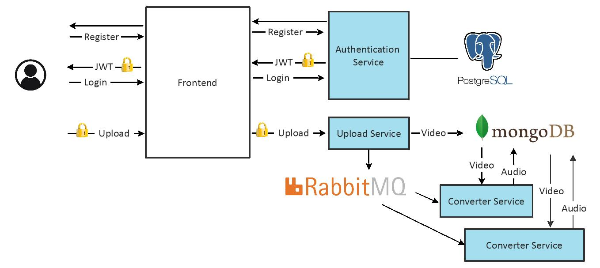
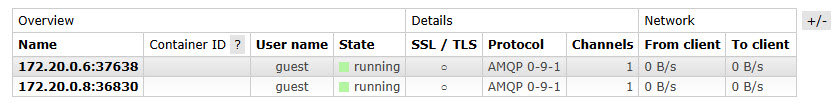
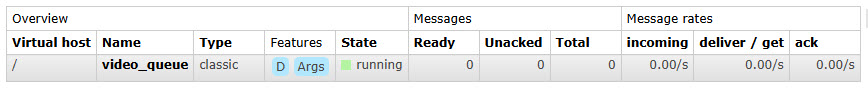
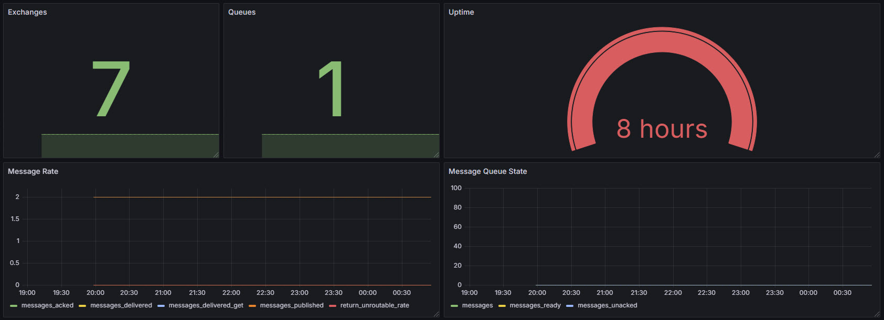
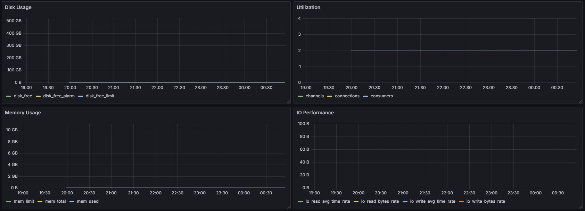
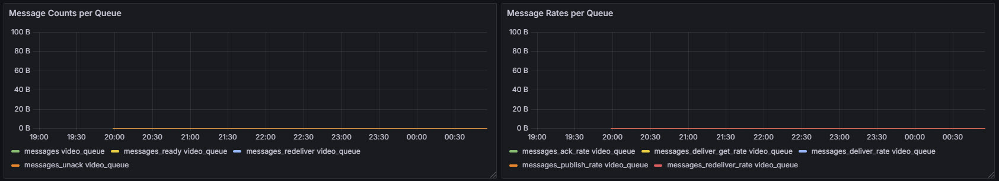

# Video2Audio

Video2Audio is an intuitive web application that enables users to authenticate, upload video files, and retrieve the extracted audio tracks. The platform is built on a microservices architecture with separated responsibilities, ensuring scalability, maintainability, and fault isolation. The system leverages:

- **PostgreSQL** for secure storage of user credentials
- **MongoDB** for efficient storage of media files (videos and audios)
- **RabbitMQ** as a message broker for asynchronous task processing

Each microservice runs in its own isolated container, all connected through a shared custom Docker bridge network. All service containers are based on lightweight Ubuntu 22.04 images, with necessary dependencies installed for each service's specific requirements.

## System Architecture

Here is the project structure:

```text
Video2Audio/
├── auth_service/         # Authentication microservice (register/login)
│   ├── app.py
│   ├── Dockerfile
│   └── models.py
├── upload_service/       # Microservice to upload videos to MongoDB and notify workers
│   ├── app.py
│   ├── Dockerfile
├── convertor_service/    # Video to audio conversion microservice
│   ├── app.py
│   ├── Dockerfile
├── frontend/             # Basic Frontend
│   ├── app.py
│   ├── Dockerfile
│   ├── templates/
│   │   ├── register.html
│   │   ├── login.html
│   │   ├── upload.html
├── docker-compose.yml
```

### Authentication Service

The `auth_service` is responsible for managing user authentication through the use of JSON Web Tokens (JWT).

#### User Registration

New users must first register by sending a `POST` request to the `/register` endpoint with their desired username and password. An example curl command for registration:

```bash
curl -X POST http://localhost:5001/register \
  -H "Content-Type: application/json" \
  -d '{"username": "myuser", "password": "mypassword"}'
```

Upon successful registration, the server responds with:

```text
{"message":"Registered successfully"}
```

In the backend, the system securely stores user credentials in a PostgreSQL database. Passwords are never stored in plaintext. Instead, they are hashed using a cryptographically secure algorithm - `bcrypt`. Unlike basic hashing methods, bcrypt applies a salt (a random value) to each password before hashing, providing strong protection against rainbow table attacks. It is intentionally computationally expensive, making brute-force attacks significantly harder by slowing down each password guess attempt. This approach ensures that even if the database is compromised, user credentials remain strongly protected.

#### User Login

To log in, users send a `POST` request to the `/login` endpoint with their username and password:

```bash
curl -X POST http://localhost:5001/login \
  -H "Content-Type: application/json" \
  -d '{"username": "myuser", "password": "mypassword"}'
```

During the login process, the backend retrieves the user record and hashed password from PostgreSQL. It then verifies the provided password against the stored bcrypt hash. Upon successful verification, it generates a JWT access token that remains valid for one hour.

```text
{"token":"<your_jwt_token>"}
```

Once a JWT token is obtained, users can access protected endpoints by including the token in the Authorization header. For example, to access the `/protected` route:

```bash
curl -X GET http://localhost:5001/protected \
  -H "Authorization: Bearer <your_jwt_token>"
```

If the token is valid and not expired, the request is authorized and the server responds accordingly.

### Upload Service

After successful authentication, the obtained JWT token can also be used to securely access other services within the system, including the upload service, by including it in the authorization headers of subsequent API requests.

Here is a POST request to send a MP4 video file to the upload service:

```bash
curl -X POST http://localhost:5003/upload \
  -H "Authorization: Bearer <your_jwt_token>" \
  -F "file=@/path/to/your/video.mp4"
```

The `/upload` endpoint in the upload_service is protected by the `@jwt_required()` decorator, which enforces that only authenticated users can access this functionality. Clients must include a valid JWT token in the Authorization header of their POST request. If the token is missing or invalid, the upload request will be rejected with an appropriate error response.

JWT (JSON Web Token) is a self-contained, digitally signed token that carries all necessary user information internally (such as username, expiration time ,etc.). Since the upload_service is configured with the shared JWT_SECRET_KEY, it can validate the token locally without making additional network calls to the authentication service. This approach improves performance, reduces latency, and allows the system to scale more efficiently under high load.

Once the authenticated request is validated, the received video file is saved into MongoDB using GridFS, a specification built for handling large binary files efficiently. While relational databases (such as PostgreSQL or MySQL) provide a BLOB (Binary Large Object) type, they are generally not optimized for storing and serving large media files like videos or audios. MongoDB's GridFS breaks large files into chunks and stores them across multiple documents, making it a better choice for scalable media storage. This design ensures that media files of any size can be uploaded without hitting database size or performance limits typical of relational databases.

After successfully storing the uploaded media, the upload_service sends a message to a RabbitMQ message broker. RabbitMQ enables asynchronous communication between services. It decouples the upload process from further processing tasks, such as audio extraction. Specifically, a worker service (the converter_service) subscribes to the message queue and asynchronously picks up new upload tasks.

### Converter Service

To enable asynchronous communication between the upload_service and one or more instances of the converter_service, the system utilizes a RabbitMQ message broker. A queue named video_queue is created within the broker to serve as the communication channel. All messages published by the upload_service are sent to the default exchange, which is a special direct exchange with an empty string ("") as its name. In RabbitMQ, queues bound to the default exchange automatically use their queue name as the routing key, meaning the video_queue is implicitly bound with a routing key of "video_queue".

Multiple instances of the converter_service are subscribed to the same queue (video_queue), forming a classic competing consumers setup. This pattern improves throughput, scalability, and fault tolerance by allowing multiple workers to process messages concurrently. RabbitMQ distributes incoming messages to consumers in a round-robin fashion, ensuring load balancing. If one converter_service instance is busy or slow, RabbitMQ automatically forwards the next message to another available instance, keeping the system responsive under load.

To prevent data loss in the event of a broker crash, service failure, or network disruption, the following message durability mechanisms are implemented:

- **Durable Queue**: The video_queue is declared with the `durable=True` flag. This instructs RabbitMQ to persist the queue definition and metadata to disk, ensuring it survives broker restarts. The queue and its bindings are automatically restored when the broker comes back online.

- **Persistent Messages**: Messages sent by the upload_service are flagged as persistent by setting the `delivery_mode=2` property. This ensures that messages are written to disk by the broker instead of being held solely in memory. As a result, messages are not lost if the broker crashes before they are consumed.

### Frontend

The frontend is the user-facing component of the system. It is built using Flask and provides a lightweight web interface that enables users to interact with the backend services. This service handles all user interactions including:

- User Registration: New users can sign up by providing a username, password, and email address. These credentials are sent to the auth_service, where they are stored after password hashing.

- User Authentication: Existing users authenticate with their credentials. Upon successful login, a JWT token is issued by the auth_service and stored in Flask session cookies. This enables secure, authenticated requests to the backend without repeatedly asking the user to log in.

- Video Upload: Authenticated users can upload video files through a simple web form. The uploaded file, along with the JWT token, is forwarded to the upload_service for processing.

## Getting Started

Clone the repository and change to the root folder:

```bash
cd Video2Audio
```

Build Docker image for all services:

```bash
docker compose build
```

Start all containers:

```bash
docker compose up -d
```

Once the containers are up, open your browser and navigate to:

```bash
http://localhost:5002
```

You will be able to:

- Register a new account
- Log in using your credentials
- Upload a video file
- Extract and store audio from the video
- Receive an email notification with download link to the audio file

Uploaded videos and extracted audio files in MongoDB are automatically deleted after 1 hour.

## Demo


Docker logs from the converter_service shows successful audio extraction:

```bash
docker logs convertor_service1

MoviePy - Writing audio in /tmp/temp_audio.mp3
MoviePy - Done.
Saving audio track to MongoDB
Audio created: 68116259f0d87e4f062f9407. Sending email to nima@gmail.com...
```

## User Interaction Flow

The following shows the user interaction flow:



1. User Registration

    When a new user accesses the application for the first time, they may initiate the registration process by navigating to the registration page, typically linked from the login screen. This triggers a `GET /register` request on the frontend, which renders a registration form prompting the user to provide a username, password, and email address.

    Upon form submission, the frontend issues a `POST /register` request to the auth_service, passing the user-provided credentials in JSON format. On the backend, the auth_service securely hashes the password using the bcrypt algorithm before persisting the record in the PostgreSQL database. If registration is successful, the service responds with a confirmation message, allowing the user to proceed with authentication.

2. User Authentication

    To initiate an authenticated session, the user navigates to the login page via a `GET /` request. This serves the login form (login.html) from the frontend, where the user is prompted to enter their username and password. As the user is not yet authenticated, access to protected resources is restricted at this point.

    When the login form is submitted, the frontend sends a `POST /login` request to the auth_service, supplying the credentials in JSON format. The service retrieves the corresponding user record from PostgreSQL and verifies the password using bcrypt. Upon successful authentication, a signed JWT token is issued and returned to the frontend. This token is temporarily stored in a secure session store and is included in subsequent requests to authenticate the user.

3. Video Upload

    Once the JWT token is obtained and stored, the frontend redirects the user to the upload interface by issuing a `GET /upload` request. The upload page (upload.html) provides a form where users can select and submit a video file. Upon form submission, a `POST /upload` request is sent to the frontend, which then forwards the file along with the user's JWT to the upload_service.

    The upload_service validates the JWT, extracts user identity, and saves the uploaded video file to MongoDB using GridFS, which is optimized for handling large binary files. Upon successful storage, the service publishes a message containing the video_id and associated metadata to the **video_queue** in RabbitMQ, enabling asynchronous processing.

4. Audio Conversion and Notification

    The **video_queue** is monitored by multiple instances of the converter_service, which act as workers. RabbitMQ dispatches the message to one of the available workers. The selected converter_service retrieves the video file from MongoDB using the provided video_id, processes the file using MoviePy to extract the audio stream, and stores the resulting .mp3 audio file back into MongoDB.

    Upon successful extraction and storage, the converter_service sends an email notification to the user using the email address obtained during registration. The message informs the user that the audio file is ready for download, completing the asynchronous video-to-audio conversion workflow.

## RabbitMQ Telemetry

We are running a RabbitMQ server with the management plugin enabled, providing a web-based interface at:

    http://localhost:15672

Through this portal, you can monitor active connections including two instances of converter_service:



As well as detailed metrics for the video_queue, such as queue depth (number of messages currently held in the queue) and message rates (how fast messages are being handled by the queue):



To collect telemetry data from RabbitMQ, I have configured Telegraf with the native RabbitMQ input [plugin](https://github.com/influxdata/telegraf/blob/master/plugins/inputs/rabbitmq/README.md). This allows Telegraf to periodically gather statistics from the broker's management API. The collected metrics are then forwarded to an InfluxDB time-series database running on a different Raspberry Pi node (Zeus), enabling historical analysis, monitoring, and visualization of RabbitMQ performance over time.

#### Broker-wide Health



#### Resource Usage & System Load



#### Per-Queue Performance


